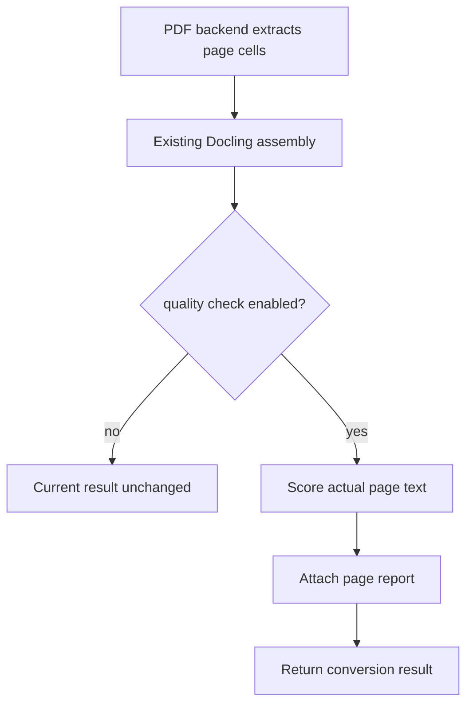

# 具体合入 Docling 的设计与 PR 路线

## 结论

第一份 PR **不改变任何 PDF 的转换结果，也不执行 OCR**。它只引入一个默认关闭的、无新增运行时依赖的“逐页文本层质量报告”能力。这样维护者可以先评审数据模型、触发位置、性能和可观测性；选择性 OCR 是维护者认可架构后才提交的后续 PR。

本仓库里的 `docling_metadata_contract.py` 是该报告结构的可执行原型，不是已经注册到 Docling 的插件，更不是已被上游采用的代码。

## 已核对的当前上游位置（Docling main，commit `890dd42`）

| 上游位置 | 当前职责 | 建议接入方式 |
| --- | --- | --- |
| `docling/datamodel/pipeline_options.py` 的 `PdfPipelineOptions` | 全功能 PDF 管线选项 | 新增嵌套的 `TextLayerQualityCheckOptions`，`enabled=False`；不改变默认值。 |
| `docling/datamodel/pipeline_options.py` 的 `NativePdfPipelineOptions` | 无模型原生 PDF 管线选项 | 同样支持报告选项，保证本项目的轻量基线和正式 PDF 管线有一致语义。 |
| `docling/pipeline/native_pdf_pipeline.py` 的 `_parse_page` | 得到每页 `parsed_page`，尚未组装 `TextItem` | 在这里对后端已提取的文本单元评分；只保存报告，不修改 `parsed_page`。 |
| `docling/pipeline/standard_pdf_pipeline.py` 的 `assemble` 后 | 已完成 OCR、版面、表格、组装 | 第一阶段只在**组装后**读取该页实际采用的文本，生成报告；绝不在这里重跑整本文档。 |
| `docling/pipeline/base_pipeline.py` 的 `execute` | `_build_document → _assemble_document → _enrich_document` | 报告必须在 `_assemble_document` 后可获取，不能把临时信息塞入用户文档正文。 |

`force_full_page_ocr` 在当前上游已是兼容性旧字段，实际应使用 `OcrMode.FULL_PAGE`。因此本项目不会把“整份文档全页 OCR”包装成新能力。

## 第一 PR 的最小改动

### 1. 配置模型

在 `pipeline_options.py` 定义 Pydantic 模型（命名需在 Issue 讨论后以维护者意见为准）：

```python
class TextLayerQualityCheckOptions(BaseModel):
    enabled: bool = False
    score_threshold: float = Field(default=0.20, ge=0.0, le=1.0)
```

并把它作为 `PdfPipelineOptions` 与 `NativePdfPipelineOptions` 的字段。默认关闭，关闭时不扫描文本、不增加模型下载、不改变输出。

### 2. 纯函数评分器

在上游已有工具目录新增一个不依赖 OCR、Tesseract 或外部模型的纯 Python 函数。输入为一页已抽取的字符串或文本单元；输出包括：

- `score`、`reasons`；
- 显式 `/gid…`、`/G…`、`(cid:…)`、替换字符、私有区字符、控制字符、空提取等信号计数；
- `recommend_ocr: bool`，只代表建议，绝不是执行命令。

禁止在评分器内“猜测正确汉字”或改写正文。

### 3. 结果承载方式

第一 PR 不改 `DoclingDocument` 的公开 schema，也不在正文插入伪文本。报告先放在 `ConversionResult` 的**可序列化、名称明确的扩展元数据**中（具体字段名由维护者决定）。每条记录只有页码、分数、原因、建议动作和版本号，不含原始 PDF 字节、文件路径或 OCR 内容。

这需要在 Issue 中请维护者确认 `ConversionResult` 当前推荐的扩展元数据 API；若没有稳定 API，第一 PR 应退为纯评分器、选项和单测，避免私自引入不合适的模型字段。

### 4. 具体调用时机



原生管线优先在 `NativePdfPipeline._parse_page` 获得原始文本单元；全功能管线则以组装后最终采用的文本为准。两者复用同一评分函数，且绝不覆盖表格/正文单元。

## 后续 PR：选择性 OCR，不预先承诺实现方式

Docling 的 OCR 目前由全 PDF 管线的阶段队列驱动，并没有已确认的“仅重跑若干页”公共接口。因此不能在第一 PR 里偷偷用 `OcrMode.FULL_PAGE` 把每本 PDF 重跑一遍。

只有在维护者确认以下任一方案后才开始第二份行为 PR：

1. 管线提供内部页号过滤/重处理钩子：把 `recommend_ocr` 页加入 OCR 队列；
2. 转换器允许安全的 `page_range` 子转换，再把对应页按稳定 API 合并；
3. 维护者认为仅输出报告更合适，则由调用方自行调度 OCR，Docling PR 止于报告能力。

无论哪种方案，回写规则均为：只处理被选中的、有可见墨迹的页面；OCR 与文本层冲突进入 `manual_review`，不自动把 OCR 当真值；空白页不会被无意义 OCR；默认仍为关闭。

## PR 切分与验收

| PR | 可提交内容 | 不包含什么 | 验收 |
| --- | --- | --- | --- |
| PR 1（首次） | 选项、纯评分器、报告契约、单测、无版权的最小生成器/复现说明 | OCR 调度、表格回写、任何真实国标 PDF | 默认关闭零行为变化；清洁页、显式异常、空页测试通过；按上游当期贡献规则签署。 |
| PR 2 | 维护者认可的结果元数据接入与 CLI/序列化测试 | 选择性 OCR | 报告可审计、稳定、无模型下载。 |
| PR 3 | 经认可的逐页 OCR 调度与端到端回归测试 | “自动相信 OCR”、整本强制 OCR | 仅候选页执行；正常页不退化；失败开放并保留原因。 |

## 本仓库与上游的关系

独立仓库继续提供 PDF 体检 CLI、低分辨率空白页防护、外部 OCR 编排、交叉审计和可复现评测。上游 PR 只贡献维护者可以独立评审和复用的最小能力。即使 PR 未合并，作品也不能声称“Docling 已采用”。
